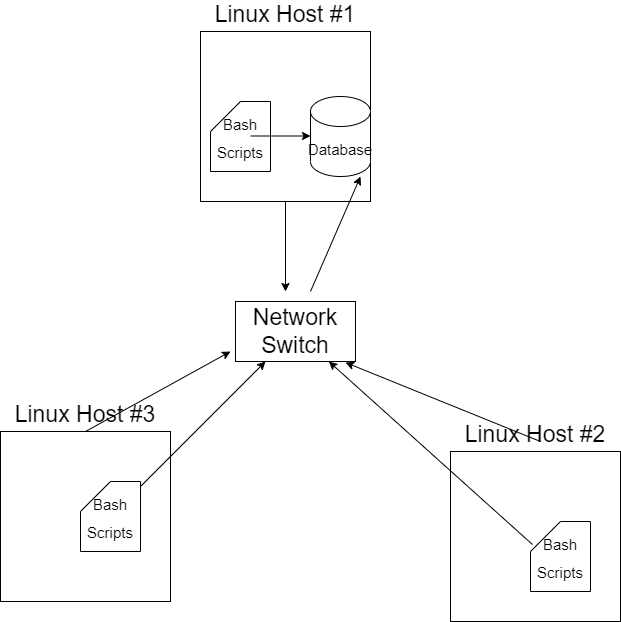

# Linux Cluster Monitoring Agent
This project is under development. Since this project follows the GitFlow, the final work will be merged to the master branch after Team Code Team.

# Introduction
We are interested in building a Minimum Viable Product (MVP) for
the Jarvis Linux Cluster Administration (LCA) team to record and
track their server's hardware specification and resource usage. 

The Jarvis LCA team will be using the database to answer business
questions and analyze each of the nodes and decide the future
resource planning. This will allow the LCA team to make decisions
more accurately with statistical evidence. 

The hardware specifications and resource usage for each of the
nodes will be recorded in a Relational Database Management System
(RDBMS).

The RDBMS that is used in this project is PostgreSQL and the
database server is set up in a container through Docker. 

To collect the hardware specification and the resource usage
of each node, Bash scripting is performed on every instance
to saturate the database. The collection of the resource usage
of each node will be automated through CRONTAB every 1 minute interval.

The communication method of all implementations or any updates
regarding the project will be done through Git and GitHub.


# Quick Start
- Start a psql instance using psql_docker.sh
```shell
# To initially create a PSQL container
bash ./scripts/psql_docker.sh create db_username db_password
# To start/stop the PSQL container
bash ./scripts/psql_docker.sh start|stop
```

- Create tables using ddl.sql
```shell
psql -h localhost -U postgres -d host_agent -f sql/ddl.sql
```

- Insert hardware specifications data into the DB using host_info.sh
```shell
bash ./scripts/host_info.sh psql_hostname psql_port db_name psql_user psql_password
```

- Insert hardware usage data into the DB using host_usage.sh
```shell
bash ./scripts/host_usage.sh psql_hostname psql_port db_name psql_user psql_password
```

- Crontab setup
```shell
crontab -e
* * * * * bash $(pwd)/scripts/host_usage.sh psql_hostname psql_port db_name psql_user psql_password
```

# Implemenation
The implementation of this MVP for the Jarvis LCA team was approached through an
agile environment following the System Development Life Cycle (SDLC) process.
In a nutshell, through the benefits of having a GitHub remote repository and its
counterpart Git I was able to work on each of the implementation portions independently
and efficiently by creating different branches for different portions of work.

First, it was important to establish a connection between PostgreSQL and its user
as it is one of its foundational portion of the project. Hence, `psql_docker.sh` bash script was
implemented first to create, start or stop the PSQL container within the docker. 

After we have a successful connection between the PSQL server and the user
it was important to automatically create the tables with their necessary columns
to start saturating them with information. The `ddl.sql` file was implemented to automatically
generate the required tables.

To acquire the information about the node's hardware specifications and resource usage
we wrote two simple bash scripts, `host_info.sh` and `host_usage.sh` which automatically
got the necessary information through bash commands and passed the information to our
PSQL container database. Note that, CRONTAB was used to run the script `host_usage.sh` every 1 minute
interval to get data on the resource usage. 

Lastly, to answer some business questions that is of interest `queries.sql` was implemented
to get data we needed for future analytical purposes. 

## Architecture


## Scripts
- psql_docker.sh

The `psql_docker.sh` is a bash script that automatically set up the PostgreSQL container
through docker given the required arguments.
```shell
bash ./scripts/psql_docker.sh create|start|stop db_username db_password
```
- host_info.sh

The `host_info.sh` is a bash script that automatically acquires the hardware specifications
on the node through several bash commands. 
```shell
bash ./scripts/host_info.sh psql_host psql_port db_name psql_user psql_password
```
- host_usage.sh

The `host_usage.sh` is a bash script that automatically acquires the resource usage on this node
through different bash commands. 
```shell
bash ./scripts/host_usage.sh psql_host psql_port db_name psql_user psql_password
```
- crontab

CRONTAB job is used to automatically run the script `host_usage.sh` every 1 minute interval
to acquire the resource usage on the particular node.
```shell
crontab -e
* * * * * bash /pwd/scripts/host_usage.sh psql_host psql_port db_name psql_user psql_password
```
- queries.sql

The `queries.sql` is a file to query different information for the purpose of analyzing the
business requirements. For example, one of the queries of interest is to get the average
memory usage over 5 minutes interval which can briefly tell the LCA team whether 
if a particular node is using too much or little of the memory. Then the LCA team can decide
whether if they need to allocate more memory to this particular node or what not. 
```shell
psql -h host_name -p psql_port -U psql_user  -p psql_password -d host_agent -f /sql/queries.sql
```

## Database Modeling
- `host_info`

| Column Name      | Data Type | Constraint            |
|------------------|-----------|-----------------------|
| id               | serial    | not null, primary key |
| hostname         | varchar   | not null, unique      |
| cpu_number       | integer   | not null              |
| cpu_architecture | varchar   | not null              |
| cpu_model        | varchar   | not null              |
| cpu_mhz          | real      | not null              |
| l2_cache         | integer   | not null              |
| total_mem        | integer   | not null              |
| timestamp        | timestamp | not null              |

- `host_usage`

| Column Name    | Data Type | Constraint            |
|----------------|-----------|-----------------------|
| timestamp      | timestamp | not null              |
| host_id        | integer   | not null, foreign key |
| memory_free    | integer   | not null              |
| cpu_idle       | integer   | not null              |
| cpu_kernel     | integer   | not null              |
| disk_io        | integer   | not null              |
| disk_available | integer   | not null              |

# Test
The test for the bash scripts were done through the terminal and due to well-designed
code we were able to simply inspect the standard output and observe to either debug
or we found a successful or desired output.

On the other hand, the SQL queries were able to tested through both command line and
the IDE we were using, IntelliJ. Through the terminal we used the PSQL commands to
execute each of the queries whereas on IntelliJ we simply ran the scripts in the IDE 
and got the desired results.

Additionally, we created sample data points in the database to test whether if 
our scripts are working correctly and if the business queries were outputting appropriate results.


# Deployment
The deployment of the MVP for the Jarvis LCA team was done through GitHub 
in the remote repository. In particular, the bash scripts and queries are included
in the remote repository. Whereas, the database instance can be set up through
the PostgreSQL image through Docker.

# Improvements
- Committing more often into the remote repository, open Pull Requests in smaller bits than in bulks.
- Merge feature branches to develop branch more frequently, and open a PR more often.
- I believe the comments and the documentation on the implementation could have been done
more thoroughly.
- The testing of the scripts and queries could be improved by using several nodes rather than just one to ensure accuracy.
- Through the queries that were made in the `queries.sql` file we could have done
a more precise data or statistical analysis to answer more business questions.