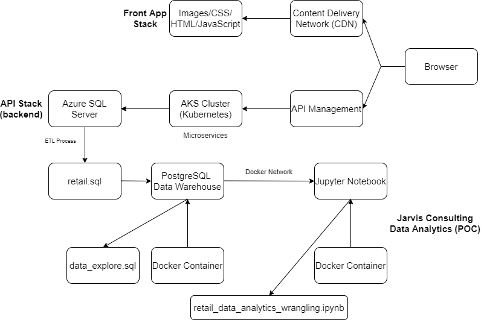

# Introduction

We are going to be building a Proof of Concept (POC) project for the London Gift Shop
(LGS) company to assist them with potentially increasing their revenue by utilizing 
the most recent and advanced data analysis technologies. As the LGS e-commerce company
has not been noticing any significant revenue increase in the recent years we will be
performing the following analysis. This includes but is not limited to, finding out their monthly placed and cancelled orders, sales growth, actively users,
etc. This will be delivered and utilized by the LGS marketing team to find out about
their customer behaviours and develop targeted marking campaigns (e.g. email, events,
target promotions, etc...) to attract new and existing users accordingly.

Throughout the POC project we will be delivering the final results and data analysis on 
Jupyter Notebook that displays various charts and diagrams. The data analysis will be
done through various Python libraries such as Pandas, NumPy, Matplotlib, etc. and we will
be using SQL alchemy library to connect our data warehouse PostgreSQL to Jupyter
Notebook to work with data frames using Pandas instead.

The network was created and connected between Jupyter Notebook and PostgreSQL through
Docker commands on bash by using our Jarvis containers of each software. The communication method
of all implementations or any updates regarding the project will be done through Git and GitHub.

# Implementation
## Project Architecture
The front end and back end of this architecture is controlled by the LGS IT team, and it
is responsible for delivering web pages for the customers and automatically store
orders and data into their Microsoft Azure SQL database server. The front end of LGS
contains the typical files CSS, JavaScript, HTML, image files, and it is using Content
Delivery Network (CDN) as a platform to communicate with users all over the world and
manage files efficiently.

The back end of LGS consists of a bunch of microservices which can be done in
Springboot or Azure web applications. The web application are running in a container,
and which the containers are managed by Kubernetes. Kubernetes is a service that can
manage or orchestrate a cluster of containers. The microservices will then store
the data into their Azure SQL server which are the transactional data. 

Due to this project being POC there will be no permission to directly work with the Azure
SQL server since it can slow down their servers and cause potential problems. 
Hence, they dumped transactional data into an SQL file which is shared with
the Jarvis Data team. As part of the ETL process, the personal information for
each customer is removed. We connect to the SQL file through our data warehouse,
PostgreSQL, to perform data analysis on Jupyter Notebook utilizing Pandas, NumPy,
Matplotlib, etc. The network between our data warehouse and Jupyter Notebook was established
by using Docker commands. 

- Here is an architecture diagram of the project:

## Data Analytics and Wrangling
The data analytics and wrangling can be found in the Jupyter Notebook [here.](./retail_data_analytics_wrangling.ipynb)

With the data provided from our data warehouse we queried some business questions
that can potentially improve the revenue for the e-commerce LGS. We investigated
upon a few basic business questions that should be answered.
- Total Invoice Amount Distribution

    We calculate the total price or the invoice amount grouping by each invoice number by 
using aggregate functions in Pandas. After drawing the diagram for the distribution
for this data it displays a few significant outliers which affects the total distribution
of the data. To resolve the outlier issues we removed any data points that is outside
the 85% quantile to get a more accurate representation of the distribution. Hence, in the
new distribution of the data it was clear that most of the data points were around the mean.

- Monthly Placed and Cancelled Orders

    Computed the placed and cancelled orders for each month and after plotting
the bar chart it is apparent that there is a very low cancellation rate which suggests that
items has been well accepted and profitable. This suggests that LGS team can try to increase
their revenue by trying to get more customers especially during months that has low placement
rates. We can say with evidence that there is a pretty low rate for which orders get cancelled 
hence should not worry about quality of the products.

- Monthly Sales
    
    Established the sales LGS made for each month and plotted a line graph that displays
the sales comparatively. Observing the diagram there were a few spikes for which the 
revenue jumped up significantly, in particular, November 2010 and 2011. This observation
can be further explained through seasonal analysis as it involves dates. Once again, to
increase the revenue it is important to by any means to get more customers during the times
there are fewer placements (i.e. hence less sales value). This can mean investing more into
marketing in different platforms during these times. It may be important to record the data
for which platforms are being used and which were the most effective in getting more customers
for future analysis.

- Monthly Sales Growth

    Calculated the monthly sales growth in % and plotted a comparative line graph to
determine the lack of growth in revenue at LGS. It can be noted that during
new years there are some significant dips in the % growth which again suggests that 
there are fewer customers and naturally less sales are being made. During new years it
may be important to, through marketing techniques invest into getting more customers
during this time of the year. Also, make micro-adjustments in investing for those months that also
has a negative slope.

- Monthly Active Users

    We found out the number of active users in each month and plotted a bar chart to
observe visually. Notice that during the new year times, there are a lot fewer active
users hence why the sales is low and may be impacting the business. Professional marketing
and investing techniques can be applied to get more customers during this time period
which can also bring up the overall sales during other months also. 

- New and Existing Users

    Computed the number of existing and new users and plotted a bar diagram to observe
the data visually. It is noticeable that the number of new users has been decreasing
ever since the beginning of the data which can suggest an advertising issue for this
e-commerce company. Once again, professional marketing or investing techniques can be
performed to potentially get more new users. Furthermore, the existing users seems to
keep coming back to LGS which is not an issue for the company so no significant problems
here.

- Finding RFM & RFM Segmentation

    Performed RFM calculations and segmentations to analyze customer value. Through
the use of Pandas `qcut` function we were able to give each of the customer numbers
a recency, frequency and monetary value scores. Then we combined each of the RFM
score into a single string and categorized each customer into a segment depending on
their RFM score as one of the following: Champions, Hibernating, at risk, potential loyalists, loyal customers, about to sllep, new customers, need attention, can't lose, promising.
Finally, we plotted a frequency and recency grid which displays the % of each segment
for the 100% of the customers. 

**Conclusion/Recommendation:**

Observing from the elementary data analysis it repeatedly displayed severe drop in
sales, users, etc. during the new year period hence suggesting that it may important
to seek professional marketing or investing techniques during these times to increase
the revenue for LGS. Note that, not does this only potentially increase the revenue for
the new year period but overall. 

The techniques that LGS will be using such as advertising on several platforms during
the new year times can be recorded as a form of data to perform future data analysis
to find out which method has been working well and not.

LGS can consult more data analysts to build statistical models to precisely find
which section of the company they need to invest more into such that they can increase
their revenue.

# Improvements
- Build statistical models for the LGS marketing team to provide them with the approach
they need to take to improve their revenue. 
- Perform data analysis based on the statistical models and prove through mathematics
that the data analysis is correct and it does not break any model assumptions.
- Establish the data the LGS team should collect for future revenue increase through
methods of design and analysis on experiments.
- Forecasting on the revenue for future years with more recent data would be beneficial
for the LGS team.